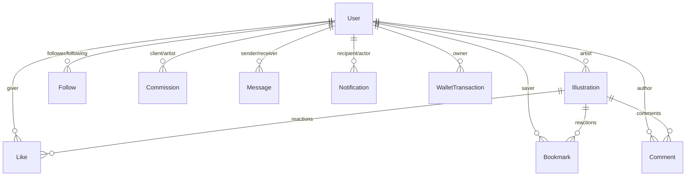

# Creative Community Platform (Online Art Gallery) - Implementation Plan

This implementation plan outlines the blueprint for building a premium, state-of-the-art **Online Art Gallery platform (Pixiv / Behance clone)**. It reflects the architecture and technology choices aligned on during our `/grill-me` architectural alignment session.

---

## Executive Summary & Shared Architectural Choices

Based on the alignment session, the platform will be implemented using a modern, unified tech stack:

1. **Database & ORM**: **MongoDB with Mongoose**. We will translate the relational schema defined in `schema-dbml.md` into highly optimized MongoDB document schemas using references and index optimizations.
2. **Frontend Setup**: **React + TypeScript with Vite** for optimal speed, developer productivity, and strict type safety.
3. **Styling & Aesthetics**: **Vanilla CSS and CSS Modules** to provide 100% custom styling, support glassmorphism, custom dark/light theme systems, responsive layouts, and rich micro-animations.
4. **State Management**: **Redux Toolkit (RTK)** for predictable global state management, combined with **RTK Query** for powerful backend API caching, synchronization, and automated data refetching.
5. **Real-time Messaging & Alerts**: **Socket.io** integration for instantaneous direct messaging, live typing status, and real-time in-app notifications.
6. **Payment & Money Management**: **Simulated Wallet & Escrow System** with virtual balances in **VND (₫)**, simulated deposits, escrow locking upon starting a commission, and payout release on completion.
7. **Image Storage & Avatars**: **Local Uploads via Multer**, served statically by the Express backend. Extremely robust, self-contained, and requiring zero external cloud keys.
8. **Authentication & Localization**: **JWT with HttpOnly Cookies** for security, with **Vietnamese (Tiếng Việt) as the default/priority interface language** to align with academic project requirements.

---

## User Review Required

Please review the architectural choices and simplicity optimizations described below.
> [!IMPORTANT]
> - **Simplicity & Deployability Focus**: As this is an academic project (đồ án) that must be deployable, we have streamlined the architecture:
>   - **Backend**: We will use **Node.js + Express with JavaScript (ES Modules)** instead of TypeScript. This eliminates compilation/build overhead on the server, making it extremely lightweight and 100% ready for zero-config deployments on platforms like Render or Railway.
>   - **Single-Service Deployability**: The Express backend will be configured to statically serve the frontend React production build (`frontend/dist`) in production. This allows you to deploy the **entire application as a single service** (meaning you only need one free-tier database and one web service instance to host the complete app!).
> - **Simulated Wallet System**: The payment system uses virtual balances rather than an external payment provider (like Stripe). This keeps the system completely self-contained, safe, and allows rapid, robust testing.
> - **Flexible Database Schema**: The database schema is simplified to ensure easy Mongoose mapping while keeping all core requirements (posts, reactions, comments, real-time messaging, notifications, wallets, and commissions) fully functional.

---

## Proposed System Architecture

### 1. File Structure Overview

We will establish a modular structure in both the `/backend` (pure ES Modules JavaScript) and `/frontend` (React + TypeScript) directories:

```
Art-Gallery/
├── backend/
│   ├── package.json
│   ├── index.js                       # Main server entrypoint (Express + Socket.io)
│   ├── config/
│   │   ├── db.js                      # MongoDB connection
│   │   └── socket.js                  # Socket.io connection setup
│   ├── controllers/                   # Request controllers
│   ├── middleware/                    # Auth guards, Multer uploaders, error boundaries
│   ├── models/                        # Mongoose Schema models
│   ├── routes/                        # API route configurations
│   ├── services/                      # Wallets, notifications, real-time message services
│   └── uploads/                       # Artwork static directories
├── frontend/
│   ├── package.json
│   ├── tsconfig.json
│   ├── vite.config.ts
│   ├── index.html
│   ├── src/
│   │   ├── main.tsx
│   │   ├── App.tsx
│   │   ├── index.css                  # Global design system & design tokens
│   │   ├── components/                # Reusable UI elements (Buttons, Inputs, Cards, Modals)
│   │   ├── layouts/                   # Global page wrappers (Sidebar, TopBar)
│   │   ├── pages/                     # High-level screens (Home, Profile, Request, Wallet, etc.)
│   │   ├── store/                     # Redux store & RTK Query APIs
│   │   ├── types/                     # Shared TypeScript declarations
│   │   └── utils/                     # Formatting, calculations, socket manager
└── project_references/                # Existing project specifications and DBML
```

---

## 2. Proposed Mongoose Database Schemas

We translate the DBML schema directly into optimized MongoDB collections with indices for fast search, feeds, and statistics.



### Schemas Details

1. **User Schema (`users`)**:
   - `username`, `email`: Required, unique, indexed.
   - `passwordHash`: String (bcrypt).
   - `bio`, `avatarUrl`, `bannerUrl`: Optional strings.
   - `nickname`: String.
   - `socialLinks`: `{ twitter: String, behance: String, artstation: String }`
   - `isArtist`: Boolean (default: `false`).
   - `walletBalance`: Number (default: `0.00`).
   - *Statistics (denormalized for profile views)*: `totalViews`, `totalLikes`, `totalBookmarks`, `totalComments`.

2. **Illustration Schema (`illustrations`)**:
   - `artistId`: ObjectId (ref `User`, required, indexed).
   - `title`: Required string.
   - `description`: String.
   - `imageUrls`: Array of strings (supporting multiple files per post as requested!).
   - `tags`: Array of strings (indexed for rapid keyword search).
   - `visibility`: Enum `['everyone', 'private', 'logged_in']` (default: `'everyone'`).
   - `commentsEnabled`: Boolean (default: `true`).
   - *Interaction Metrics (for ranking system)*: `viewsCount`, `likesCount`, `bookmarksCount`, `commentsCount`.
   - `createdAt`: Date (default: `now`, indexed for feed chronological sorting).

3. **Reaction Schemas (`likes` & `bookmarks`)**:
   - `userId`: ObjectId (ref `User`, required).
   - `illustrationId`: ObjectId (ref `Illustration`, required).
   - *Unique index* on `(userId, illustrationId)` to prevent duplicate reactions.

4. **Follow Schema (`follows`)**:
   - `followerId`: ObjectId (ref `User`, required, indexed).
   - `followingId`: ObjectId (ref `User`, required, indexed).
   - *Unique index* on `(followerId, followingId)` to prevent multiple following records.

5. **Comment Schema (`comments`)**:
   - `illustrationId`: ObjectId (ref `Illustration`, required, indexed).
   - `userId`: ObjectId (ref `User`, required).
   - `parentCommentId`: ObjectId (ref `Comment`, optional) - allows nested threads.
   - `content`: Required string.
   - `createdAt`: Date.

6. **Commission Schema (`commissions`)** (Dựa theo luồng Pixiv Request):
   - `clientId`: ObjectId (ref `User`, required, indexed) - Fan đặt tranh.
   - `artistId`: ObjectId (ref `User`, required, indexed) - Họa sĩ nhận vẽ.
   - `title`, `description`: Nội dung yêu cầu vẽ (Brief).
   - `price`: Number (Tiền tệ VND - VNĐ, ví dụ: 500,000đ).
   - `deadline`: Date - Hạn chót hoàn thành.
   - `paymentStatus`: Enum `['unpaid', 'escrow', 'paid_to_artist', 'refunded']` (mặc định `'unpaid'`).
     - `'escrow'`: Tiền của Client đang bị tạm giữ ở ví trung gian.
     - `'paid_to_artist'`: Tiền đã giải ngân cho Họa sĩ khi hoàn thành.
     - `'refunded'`: Tiền đã được hoàn lại cho Fan nếu Họa sĩ từ chối/hủy/hết hạn.
   - `status`: Enum `['pending', 'accepted', 'in_progress', 'completed', 'canceled', 'rejected']` (mặc định `'pending'`).
     - `'pending'` (Gửi yêu cầu): Chờ họa sĩ duyệt. Tiền được tạm giữ (`escrow`).
     - `'accepted'` (Chấp nhận): Họa sĩ nhận vẽ.
     - `'in_progress'` (Đang vẽ): Họa sĩ đang tiến hành vẽ.
     - `'completed'` (Hoàn thành): Họa sĩ đăng tải sản phẩm. Tiền giải ngân sang ví Họa sĩ.
     - `'canceled'` (Hủy bỏ/Hết hạn): Không duyệt trước deadline hoặc Client hủy khi chưa nhận, hoàn tiền cho Fan.
     - `'rejected'` (Từ chối): Họa sĩ từ chối nhận, hoàn tiền cho Fan.
   - `resultIllustrationId`: ObjectId (ref `Illustration`, optional) - Liên kết tác phẩm tranh vẽ sau khi hoàn thành.
   - `isPrivate`: Boolean (default: `false`) - Client yêu cầu giữ kín tranh, không đăng công khai.

7. **Message Schema (`messages`)**:
   - `senderId`: ObjectId (ref `User`, required, indexed).
   - `receiverId`: ObjectId (ref `User`, required, indexed).
   - `content`: Required string.
   - `isRead`: Boolean (default: `false`).
   - `createdAt`: Date.

8. **Notification Schema (`notifications`)**:
   - `recipientId`: ObjectId (ref `User`, required, indexed).
   - `actorId`: ObjectId (ref `User`, optional) - who triggered the action.
   - `type`: Enum `['new_illustration', 'like', 'bookmark', 'follow', 'comment', 'reply', 'commission_update', 'message']`.
   - `targetId`: ObjectId - ID of the related object (illustration, commission, comment, etc.).
   - `targetModel`: String - ref model (`Illustration`, `Commission`, `Comment`).
   - `contentPreview`: String - short text.
   - `isRead`: Boolean (default: `false`).
   - `createdAt`: Date.

9. **WalletTransaction Schema (`wallet_transactions`)**:
   - `userId`: ObjectId (ref `User`, required, indexed).
   - `amount`: Number.
   - `type`: Enum `['deposit', 'withdraw', 'escrow_hold', 'escrow_release', 'escrow_refund']`.
   - `referenceId`: ObjectId (ref `Commission`, optional).
   - `description`: String.
   - `createdAt`: Date.

---

## 3. UI/UX Design & Aesthetic Systems

To create a premium-tier, jaw-dropping visual experience, the frontend will employ a detailed design system:

- **Harsh Browser Defaults Avoided**: We will import the premium typography font **Outfit** or **Plus Jakarta Sans** from Google Fonts.
- **Glassmorphism**: Main panels, headers, and floating elements will use translucent backgrounds with custom filters:
  ```css
  background: rgba(255, 255, 255, 0.05);
  backdrop-filter: blur(12px) saturate(180%);
  border: 1px solid rgba(255, 255, 255, 0.1);
  ```
- **Harmonious Sleek Dark Mode**: Designed using a rich dark palette (deep charcoals `#0B0C10`, vibrant deep indigo accents `#4F46E5`, and warm cyan highlights `#06B6D4`) rather than harsh blacks.
- **Fluid Layouts**: Responsive navigation panel on the left (collapsible), top sticky bar with transparent gradient blurs, standard grid cards for artworks using CSS Grid with auto-fit, and Masonry-like image stacks.
- **Rich Micro-Animations**: Smooth transitions on hover, floating button lifts, comment section transitions, reactive heart/bookmark pulses, and active message indicators.

---

## Proposed Implementation Steps

### Phase 1: Environment & Foundation Setup
1. **Backend Initialize**: Create `backend/package.json` with `"type": "module"`, and install core dependencies (`express`, `mongoose`, `jsonwebtoken`, `bcryptjs`, `cookie-parser`, `cors`, `multer`, `socket.io`).
2. **Frontend Initialize**: Scaffold a React + TypeScript application with Vite in `/frontend`. Install `@reduxjs/toolkit`, `react-redux`, `react-router-dom`, `socket.io-client`.
3. **Design System & Styling**: Define css design tokens (colors, gradients, custom animations, transitions, typography variables) inside `frontend/src/index.css`.
4. **Database Configuration**: Implement the Mongoose connection client in `backend/config/db.js` connecting to a MongoDB instance.

### Phase 2: Backend Models & Core Services
1. Write the Mongoose schema definitions in `backend/models/` for all collections.
2. Implement central helper services:
   - `authService`: Token signing, password hashing, and user validation.
   - `walletService`: Core operations for deposit, withdrawal, holding money in escrow, releasing funds, or executing refunds.
   - `notificationService`: Programmatic trigger of notifications and dispatching them dynamically via WebSockets.

### Phase 3: Core API Endpoints & Business Logic
1. **Authentication Route**: Login, Register, Logout, Refresh, and User Profile configuration with cookie persistence.
2. **Illustration Route**: Multer-based multi-file upload, title, description, tagging, private visibility settings, like/unlike toggling, bookmarking, and chronological/ranked feeds.
3. **Follow & Interaction Route**: Profile follow triggers, follow listings, and dynamic creation of "Newest by followed" feeds.
4. **Comment Route**: Fetch illustration comment trees (with threaded replies support), dynamic creation of comments, and notification firing.
5. **Commission & Wallet Route**: Create, accept, process, deliver, and close commissions, updating wallet balances, locking escrow funds, and rendering wallet invoices.
6. **Socket Server**: Wire up Socket.io connection handshakes, rooms for real-time messaging, and alert notifications.

### Phase 4: Frontend Redux Store & API Integration
1. Structure the global Redux state inside `frontend/src/store/`.
2. Configure RTK Query endpoint divisions:
   - `authApi`: Signin, signup, current session profile.
   - `illustrationApi`: Feed querying, image uploads, post actions.
   - `commentApi`: Thread updates and reactions.
   - `commissionApi`: Client/artist requests and states.
   - `walletApi`: Deposits, transactions, ledger.
   - `chatApi`: Messaging query.

### Phase 5: Premium Component and Page Construction
1. **Navigation Layout**: Glassmorphic sidebar navigation and dynamic top header containing global search and current user balance display.
2. **Home Screen**: Featuring a gorgeous carousel of trending tags, active hero recommendation cards, and masonry grids showcasing "Recommended Works", "Rankings", "Newest by followed", and "Newest by all".
3. **Post Details Screen**: High-resolution carousel showing multiple image files, expandable detail sidebar, dynamic tags, comment sections with nesting, and immediate like/bookmark feedback.
4. **Creator Portfolio Screen**: Clean, responsive layout showcasing artist statistics, avatars, banner covers, custom request buttons, social handles, and grid view categories.
5. **Commissions & Request Panel**: Streamlined workflows to create custom briefs, approve briefs, review drafts, and execute wallet-driven escrow payouts.
6. **Real-time Messenger**: Interactive double-column chat screen displaying conversation items, online indicators, and instant real-time chats.
7. **Settings & Wallet Dashboard**: Visual ledger lists, balance charts, deposit simulations, language switches (EN/VN), and secure password triggers.

### Phase 6: Polish, Polish, Polish!
1. Add beautiful micro-animations to heart buttons, sidebar links, and loading spinners.
2. Test theme triggers and multi-language routing switches.
3. Review responsive views on viewport changes.

---

## Verification Plan

### Automated & Manual Verification Steps

1. **API Functional Tests**:
   - Write localized scripts or use `curl` to test auth registration, multi-image upload, and feed indexing.
   - We can verify real-time Socket.io transmissions by mocking client connections.
2. **Browser Testing (UI/UX validation)**:
   - Boot both `npm run dev` servers.
   - Use our visual tools to review layout rendering, ensuring the theme toggles (Dark/Light) and Language toggles (Vietnamese/English) swap seamlessly without layout shifts.
   - Inspect the interactive animations, transitions, and responsive grid behaviors.
3. **Wallet Ledger Auditing**:
   - Create two test users (one fan client, one artist).
   - Deposit simulated funds into the client's wallet.
   - Request a commission, verify client balance is deducted and locked in escrow.
   - Accept the commission by the artist, mark complete, and upload result work.
   - Confirm escrow releases to the artist's wallet balance, ensuring exact audit balances.
